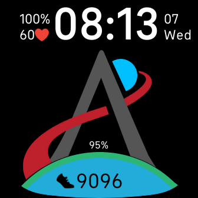

# Artemis I
Inspired by NASA Mission [Artemis](https://www.nasa.gov/specials/artemis/), I created a clockface for Fitbit Sense and Fitbit Versa.

  

## About

This is a digital clock with following sensor information:
+ Battery
+ Heart Rate
+ Steps
+ Floors
+ Distance

You can enable or disable tiny animation and set the Moon color.
In settings you can establish your time period and following the progress on your watch.
For example you can set the start time of the [rocket launch](https://www.nasa.gov/artemis-1) and end time as the rocket descending.

Avaliable in the Fitbit App Gallery

## License
This project is open source, and conforms to the [MIT License](./LICENSE)