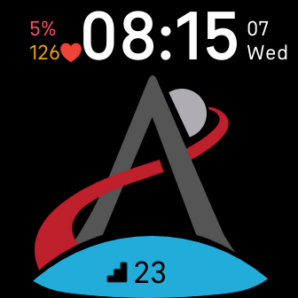

# Artemis I
Inspired by NASA Mission [Artemis](https://www.nasa.gov/specials/artemis/), I created a clock for Fitbit Sense and Fitbit Versa.

  

## About

This is an digical clock with following sensor information:
+ Battery
+ Heart Rate
+ Steps
+ Floors
+ Distance

In additional you can set period in time and see a progress. For example, time till the deadline or report preparation.
